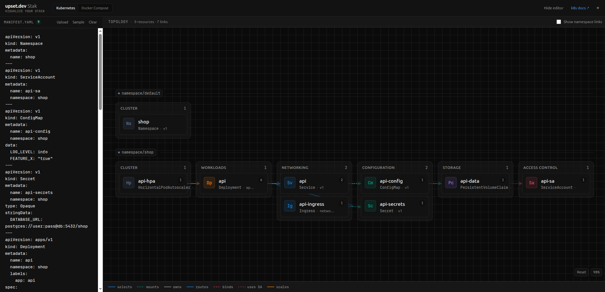

  

<h1 align="center">Stak</h1>

  <strong>Visualize your Kubernetes manifests and Docker Compose files as an interactive topology map.</strong> 
  Paste your YAML config, and instantly see your stack visualized.

---

Stak is a simple way to turn your Kubernetes manifests and Docker Compose files into a clear, interactive map.

Just paste or upload a YAML file, and Stak visualizes your stack as connected resource cards, showing how services, workloads, networks, and configs relate at a glance.

## Screenshot

## Features

- **Kubernetes**: supports Deployments, Services, Ingresses, ConfigMaps, Secrets, PVCs, RBAC, HPAs, and more.
- **Docker Compose**: services, volumes, networks, configs, and secrets.
- **Topology canvas**: pan and zoom an infinite canvas; drag to move, scroll to zoom.
- **Relationship lines**: selects, mounts, owns, routes, binds, uses-SA, scales, in-namespace.
- **Resource details**: click any card to inspect its full spec.
- **Resizable editor**: drag the divider to adjust the YAML editor width.
- **Dark mode**: persisted to localStorage.
- **Multi-document YAML**: `---` separated files are supported.
- **File upload**: drag-and-drop or upload `.yaml` / `.yml` files.

## Getting started

Go to [https://stak.upset.dev](https://stak.upset.dev), paste your YAML config, and instantly see your stack visualized.

## License

MIT
